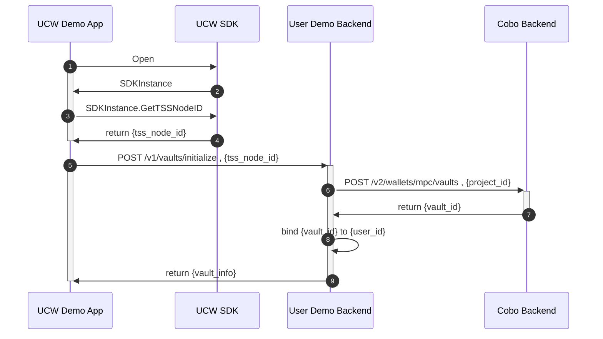

```mermaid
sequenceDiagram
    autonumber
    participant App as UCW Demo App
    participant SDK as UCW SDK
    participant C as User Demo Backend
    participant P as Cobo Backend

    App ->> SDK: Open
    activate App
    SDK ->> App: SDKInstance
    App ->> SDK: SDKInstance.GetTSSNodeID
    SDK ->> App: return {tss_node_id}
    deactivate App
    App ->> +C: POST /v1/vaults/initialize , {tss_node_id}
    activate App
    C ->> +P: POST /v2/wallets/mpc/vaults , {project_id}
    P ->> -C: return {vault_id}
    C ->> C: bind {vault_id} to {user_id}
    C ->> -App: return {vault_info}
    deactivate App
```
