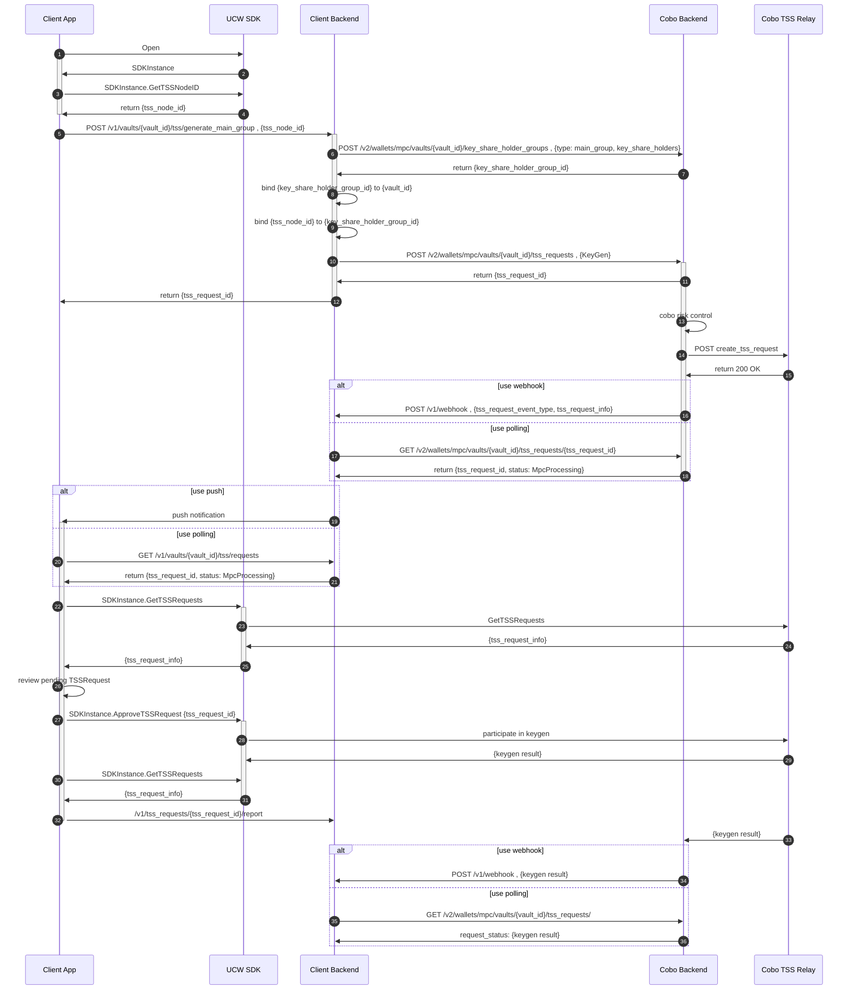

```mermaid
sequenceDiagram
    autonumber
    participant App as Client App
    participant SDK as UCW SDK
    participant C as Client Backend
    participant P as Cobo Backend
    participant R as Cobo TSS Relay

    App ->> SDK: Open
    activate App
    SDK ->> App: SDKInstance
    App ->> SDK: SDKInstance.GetTSSNodeID
    SDK ->> App: return {tss_node_id}
    deactivate App

    App ->> +C: POST /v1/vaults/{vault_id}/tss/generate_main_group , {tss_node_id}
    C ->> P: POST /v2/wallets/mpc/vaults/{vault_id}/key_share_holder_groups , {type: main_group, key_share_holders}
    P ->> C: return {key_share_holder_group_id}
    C ->> C: bind {key_share_holder_group_id} to {vault_id}
    C ->> C: bind {tss_node_id} to {key_share_holder_group_id}
    C ->> +P: POST /v2/wallets/mpc/vaults/{vault_id}/tss_requests , {KeyGen}
    P ->> C: return {tss_request_id}
    C ->> -App: return {tss_request_id}
    P ->> P: cobo risk control
    P ->> R: POST create_tss_request
    R ->> P: return 200 OK

    alt use webhook
        P ->> C: POST /v1/webhook , {tss_request_event_type, tss_request_info}
    else use polling
        C ->> P: GET /v2/wallets/mpc/vaults/{vault_id}/tss_requests/{tss_request_id}
        P ->> -C: return {tss_request_id, status: MpcProcessing}
    end

    activate App
    alt use push
        C ->> +App: push notification
    else use polling
        App ->> C: GET /v1/vaults/{vault_id}/tss/requests
        C ->> App: return {tss_request_id, status: MpcProcessing}
    end


    App ->> +SDK: SDKInstance.GetTSSRequests
    SDK ->> R: GetTSSRequests
    R ->> SDK: {tss_request_info}
    SDK ->> -App: {tss_request_info}
    App ->> App: review pending TSSRequest
    App ->> +SDK: SDKInstance.ApproveTSSRequest {tss_request_id}
    SDK ->> R: participate in keygen
    R ->> SDK: {keygen result}
    App ->> SDK: SDKInstance.GetTSSRequests
    SDK ->> -App: {tss_request_info}
    App ->> C: /v1/tss_requests/{tss_request_id}/report
    deactivate App

    R ->> P: {keygen result}

    alt use webhook
        P ->> C: POST /v1/webhook , {keygen result}
    else use polling
        C ->> P: GET /v2/wallets/mpc/vaults/{vault_id}/tss_requests/
        P ->> C: request_status: {keygen result}
    end

```