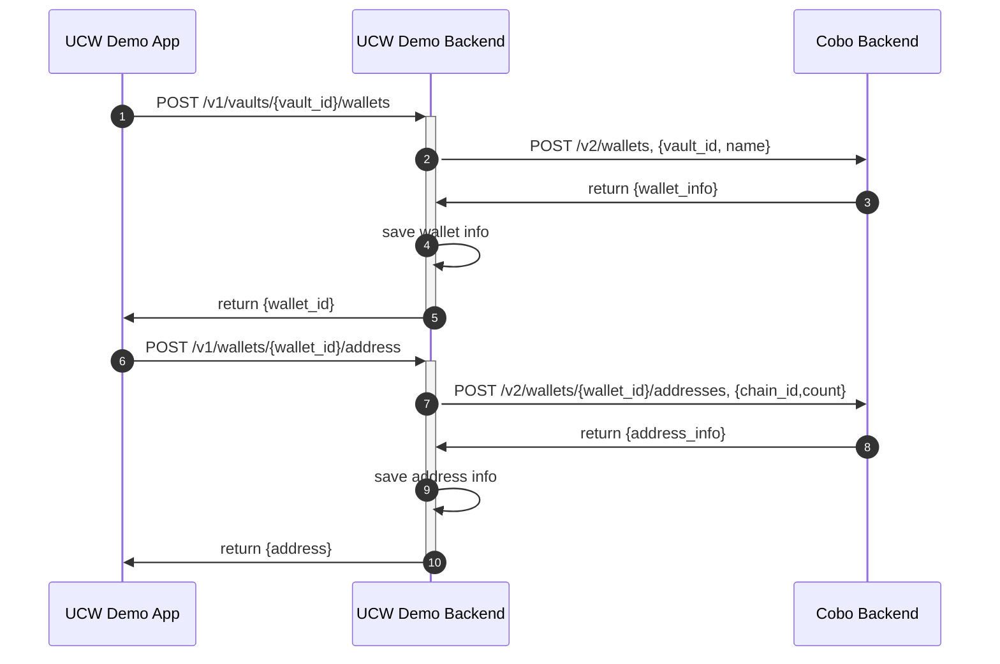

```mermaid
sequenceDiagram
    autonumber
    participant App as UCW Demo App
    participant C as UCW Demo Backend
    participant P as Cobo Backend

    App ->> +C: POST /v1/vaults/{vault_id}/wallets
    C ->> P: POST /v2/wallets, {vault_id, name}
    P ->> C: return {wallet_info}
    C ->> C: save wallet info
    C ->> -App: return {wallet_id}
    App ->> +C: POST /v1/wallets/{wallet_id}/address
    C ->> P: POST /v2/wallets/{wallet_id}/addresses, {chain_id,count}
    P ->> C: return {address_info}
    C ->> C: save address info
    C ->> -App: return {address}


```
