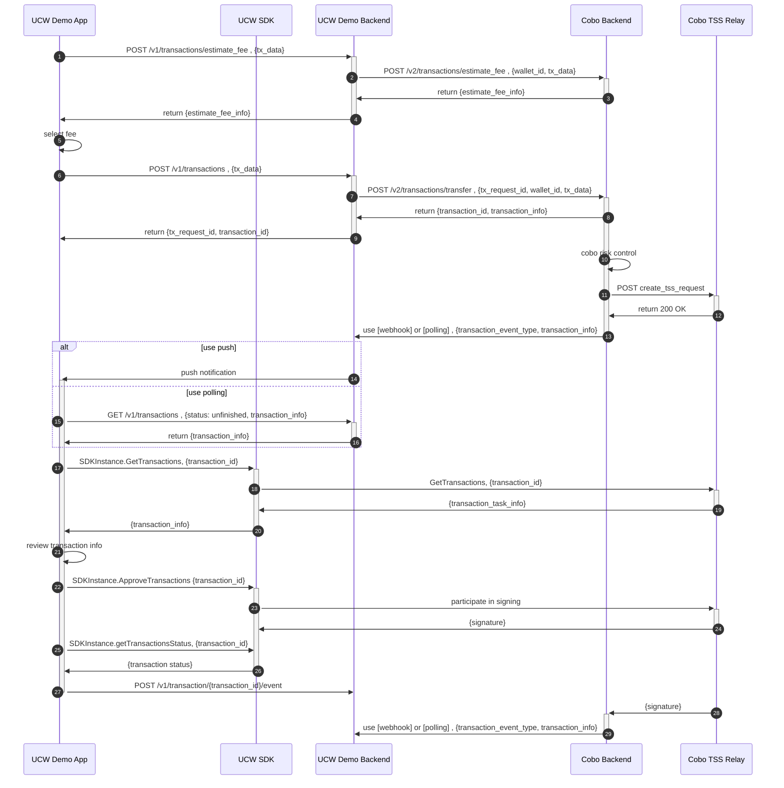

```mermaid
sequenceDiagram
    autonumber
    participant App as UCW Demo App
    participant SDK as UCW SDK
    participant C as UCW Demo Backend
    participant P as Cobo Backend
    participant R as Cobo TSS Relay

    App ->> +C: POST /v1/transactions/estimate_fee , {tx_data}
    C ->> +P: POST /v2/transactions/estimate_fee , {wallet_id, tx_data}
    P ->> -C: return {estimate_fee_info}
    C ->> -App: return {estimate_fee_info}
    
    App ->> App: select fee

    App ->> +C: POST /v1/transactions , {tx_data}
    C ->> +P: POST /v2/transactions/transfer , {tx_request_id, wallet_id, tx_data}
    P ->> C: return {transaction_id, transaction_info}
    C ->> -App: return {tx_request_id, transaction_id}
    P ->> P: cobo risk control
    P ->> +R: POST create_tss_request
    R ->> -P: return 200 OK
    P ->> -C: use [webhook] or [polling] , {transaction_event_type, transaction_info}
    
    activate App
    alt use push
        C ->> +App: push notification
    else use polling
        App ->> +C: GET /v1/transactions , {status: unfinished, transaction_info}
        C ->> -App: return {transaction_info}
    end
    
    App ->> +SDK: SDKInstance.GetTransactions, {transaction_id}
    SDK ->> +R: GetTransactions, {transaction_id}
    R ->> -SDK: {transaction_task_info}
    SDK ->> -App: {transaction_info}

    App ->> App: review transaction info
    App ->> +SDK: SDKInstance.ApproveTransactions {transaction_id}
    SDK ->> +R: participate in signing
    R ->> -SDK: {signature}
    App ->> SDK: SDKInstance.getTransactionsStatus, {transaction_id}
    SDK ->> -App: {transaction status}
    App ->> C: POST /v1/transaction/{transaction_id}/event
    deactivate App

    R ->> +P: {signature}
    P ->> -C: use [webhook] or [polling] , {transaction_event_type, transaction_info}


```
