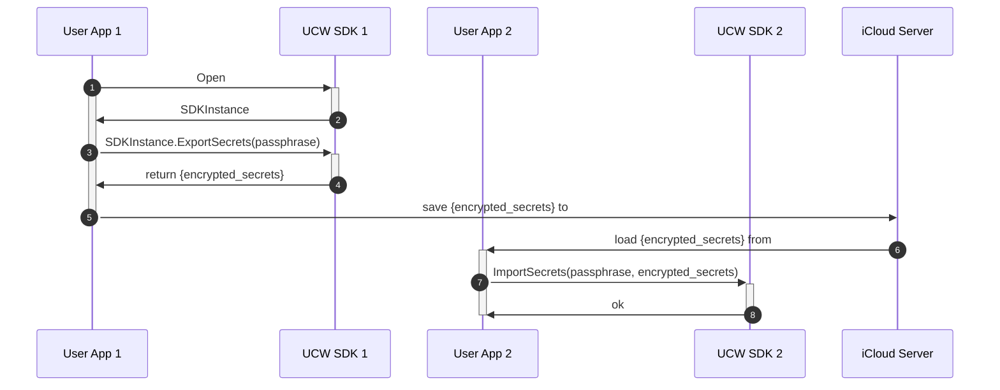

```mermaid
sequenceDiagram
    autonumber
    participant App1 as User App 1
    participant SDK1 as UCW SDK 1
    participant App2 as User App 2
    participant SDK2 as UCW SDK 2
    participant I as iCloud Server

    App1 ->> +SDK1: Open
    activate App1
    SDK1 ->> -App1: SDKInstance
    App1 ->> +SDK1: SDKInstance.ExportSecrets(passphrase)
    SDK1 ->> -App1: return {encrypted_secrets}
    App1 ->>- I: save {encrypted_secrets} to
    I ->> +App2: load {encrypted_secrets} from
    App2 ->> +SDK2: ImportSecrets(passphrase, encrypted_secrets)
    SDK2 ->> -App2: ok
    deactivate App2

```
