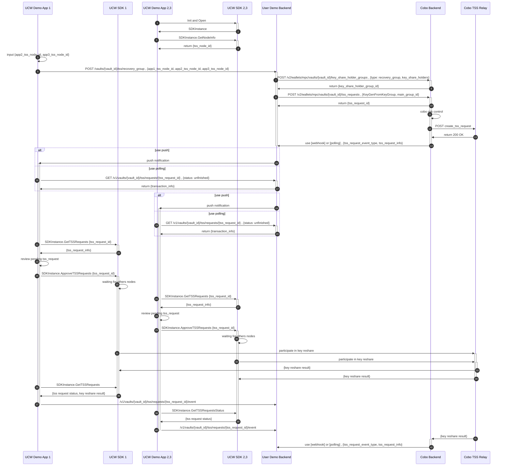

```mermaid
sequenceDiagram
    autonumber
    participant App1 as UCW Demo App 1
    participant SDK1 as UCW SDK 1
    participant App23 as UCW Demo App 2,3
    participant SDK23 as UCW SDK 2,3
    participant C as User Demo Backend
    participant P as Cobo Backend
    participant R as Cobo TSS Relay

    App23 ->> +SDK23: Init and Open
    activate App23
    SDK23 ->> -App23: SDKInstance
    App23 ->> +SDK23: SDKInstance.GetNodeInfo
    SDK23 ->> -App23: return {tss_node_id}

    App1 ->> App1: input {app2_tss_node_id, app3_tss_node_id}

    App1 ->> C: POST /vaults/{vault_id}/tss/recovery_group , {app1_tss_node_id, app2_tss_node_id, app3_tss_node_id}
    activate C
    C ->> +P: POST /v2/wallets/mpc/vaults/{vault_id}/key_share_holder_groups , {type: recovery_group, key_share_holders}
    P ->> -C: return {key_share_holder_group_id}

    C ->> +P: POST /v2/wallets/mpc/vaults/{vault_id}/tss_requests , {KeyGenFromKeyGroup, main_group_id}
    P ->> C: return {tss_request_id}
    P ->> P: cobo risk control
    P ->> R: POST create_tss_request
    R ->> P: return 200 OK
    P ->> -C: use [webhook] or [polling] , {tss_request_event_type, tss_request_info}
    deactivate C

    activate App1
    alt use push
        C ->> +App1: push notification
    else use polling
        App1 ->> +C: GET /v1/vaults/{vault_id}/tss/requests/{tss_request_id} , {status: unfinished}
        C ->> -App1: return {transaction_info}
    end

    activate App23
    alt use push
        C ->> +App23: push notification
    else use polling
        App23 ->> +C: GET /v1/vaults/{vault_id}/tss/requests/{tss_request_id} , {status: unfinished}
        C ->> -App23: return {transaction_info}
    end

    App1 ->> +SDK1: SDKInstance.GetTSSRequests {tss_request_id}
    SDK1 ->> -App1: {tss_request_info}
    App1 ->> App1: review pending tss_request
    App1 ->> +SDK1: SDKInstance.ApproveTSSRequests {tss_request_id}
    SDK1 ->> SDK1: waiting for others nodes

    App23 ->> +SDK23: SDKInstance.GetTSSRequests {tss_request_id}
    SDK23 ->> -App23: {tss_request_info}
    App23 ->> App23: review pending tss_request
    App23 ->> +SDK23: SDKInstance.ApproveTSSRequests {tss_request_id}
    SDK23 ->> SDK23: waiting for others nodes

    SDK1 ->> +R: participate in key reshare
    SDK23 ->> +R: participate in key reshare

    R ->> -SDK1: {key reshare result}
    R ->> -SDK23: {key reshare result}

    App1 ->> SDK1: SDKInstance.GetTSSRequests
    SDK1 ->> -App1: {tss request status, key reshare result}
    App1 ->> C: /v1/vaults/{vault_id}/tss/requests/{tss_request_id}/event
    deactivate App1

    App23 ->> SDK23: SDKInstance.GetTSSRequestsStatus
    SDK23 ->> -App23: {tss request status}
    App23 ->> C: /v1/vaults/{vault_id}/tss/requests/{tss_request_id}/event
    deactivate App23

    R ->> +P: {key reshare result}
    P ->> -C: use [webhook] or [polling] , {tss_request_event_type, tss_request_info}

```
