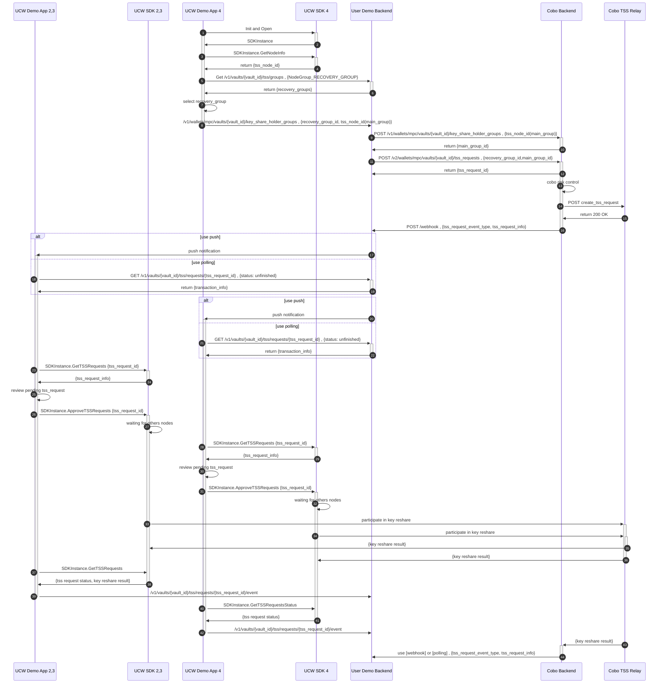

```mermaid
sequenceDiagram
    autonumber
    participant App23 as UCW Demo App 2,3
    participant SDK23 as UCW SDK 2,3
    participant App4 as UCW Demo App 4
    participant SDK4 as UCW SDK 4
    participant C as User Demo Backend
    participant P as Cobo Backend
    participant R as Cobo TSS Relay

    App4 ->> +SDK4: Init and Open
    activate App4
    SDK4 ->> -App4: SDKInstance
    App4 ->> +SDK4: SDKInstance.GetNodeInfo
    SDK4 ->> -App4: return {tss_node_id}
    
    App4 ->> +C: Get /v1/vaults/{vault_id}/tss/groups , {NodeGroup_RECOVERY_GROUP}
    C ->> -App4: return {recovery_groups}
    
    App4 ->> App4: select recovery_group

    App4 ->> -C: /v1/wallets/mpc/vaults/{vault_id}/key_share_holder_groups , {recovery_group_id, tss_node_id(main_group)}
    
    
    C ->> +P: POST /v1/wallets/mpc/vaults/{vault_id}/key_share_holder_groups , {tss_node_id(main_group)}
    P ->> -C: return {main_group_id}

    C ->> +P: POST /v2/wallets/mpc/vaults/{vault_id}/tss_requests , {recovery_group_id,main_group_id}
    P ->> C: return {tss_request_id}

    P ->> P: cobo risk control
    P ->> R: POST create_tss_request
    R ->> P: return 200 OK
    P ->> -C: POST /webhook , {tss_request_event_type, tss_request_info}

    activate App23
    alt use push
        C ->> +App23: push notification
    else use polling
        App23 ->> +C: GET /v1/vaults/{vault_id}/tss/requests/{tss_request_id} , {status: unfinished}
        C ->> -App23: return {transaction_info}
    end

    activate App4
    alt use push
        C ->> +App4: push notification
    else use polling
        App4 ->> +C: GET /v1/vaults/{vault_id}/tss/requests/{tss_request_id} , {status: unfinished}
        C ->> -App4: return {transaction_info}
    end

    App23 ->> +SDK23: SDKInstance.GetTSSRequests {tss_request_id}
    SDK23 ->> -App23: {tss_request_info}
    App23 ->> App23: review pending tss_request
    App23 ->> +SDK23:SDKInstance.ApproveTSSRequests {tss_request_id}
    SDK23 ->> SDK23: waiting for others nodes

    App4 ->> +SDK4: SDKInstance.GetTSSRequests {tss_request_id}
    SDK4 ->> -App4: {tss_request_info}
    App4 ->> App4: review pending tss_request
    App4 ->> +SDK4: SDKInstance.ApproveTSSRequests {tss_request_id}
    SDK4 ->> SDK4: waiting for others nodes

    SDK23 ->> +R: participate in key reshare
    SDK4 ->> +R: participate in key reshare

    R ->> -SDK23: {key reshare result}
    R ->> -SDK4: {key reshare result}

    App23 ->> SDK23: SDKInstance.GetTSSRequests
    SDK23 ->> -App23: {tss request status, key reshare result}
    App23 ->> C: /v1/vaults/{vault_id}/tss/requests/{tss_request_id}/event
    deactivate App23

    App4 ->> SDK4: SDKInstance.GetTSSRequestsStatus
    SDK4 ->> -App4: {tss request status}
    App4 ->> C: /v1/vaults/{vault_id}/tss/requests/{tss_request_id}/event
    deactivate App4

    R ->> +P: {key reshare result}
    P ->> -C: use [webhook] or [polling] , {tss_request_event_type, tss_request_info}

```
