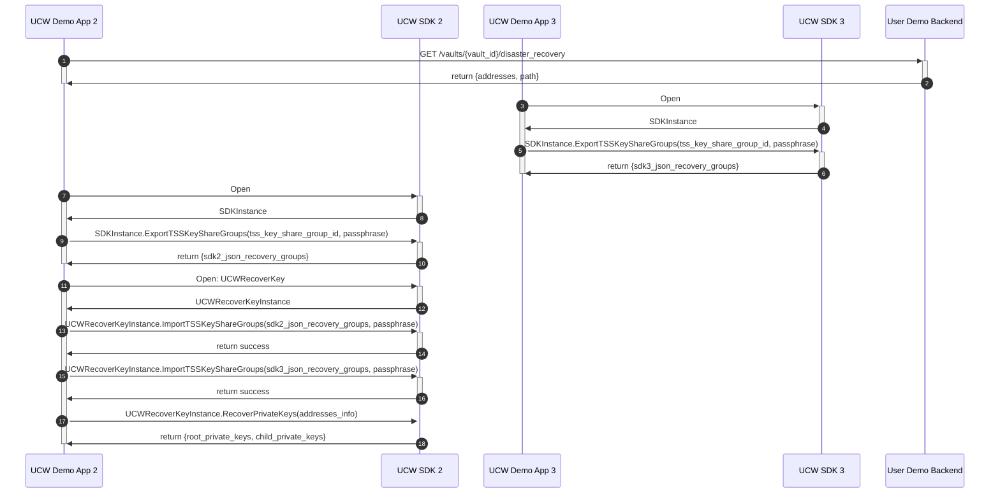

```mermaid
sequenceDiagram
    autonumber
    participant App2 as UCW Demo App 2
    participant SDK2 as UCW SDK 2
    participant App3 as UCW Demo App 3
    participant SDK3 as UCW SDK 3
    participant C as User Demo Backend

    App2 ->> +C: GET /vaults/{vault_id}/disaster_recovery
    activate App2
    C ->> -App2: return {addresses, path}
    deactivate App2

    App3 ->> +SDK3: Open
    activate App3
    SDK3 ->> -App3: SDKInstance
    App3 ->> +SDK3: SDKInstance.ExportTSSKeyShareGroups(tss_key_share_group_id, passphrase)
    SDK3 ->> -App3: return {sdk3_json_recovery_groups}
    deactivate App3

    App2 ->> +SDK2: Open
    activate App2
    SDK2 ->> -App2: SDKInstance
    App2 ->> +SDK2: SDKInstance.ExportTSSKeyShareGroups(tss_key_share_group_id, passphrase)
    SDK2 ->> -App2: return {sdk2_json_recovery_groups}
    deactivate App2

    App2 ->> +SDK2: Open: UCWRecoverKey
    activate App2
    SDK2 ->> -App2: UCWRecoverKeyInstance
    App2 ->> +SDK2: UCWRecoverKeyInstance.ImportTSSKeyShareGroups(sdk2_json_recovery_groups, passphrase)
    SDK2 ->> -App2: return success
    App2 ->> +SDK2: UCWRecoverKeyInstance.ImportTSSKeyShareGroups(sdk3_json_recovery_groups, passphrase)
    SDK2 ->> -App2: return success
    App2 ->> +SDK2: UCWRecoverKeyInstance.RecoverPrivateKeys(addresses_info)
    SDK2 ->> App2: return {root_private_keys, child_private_keys}
    deactivate App2
    
```
