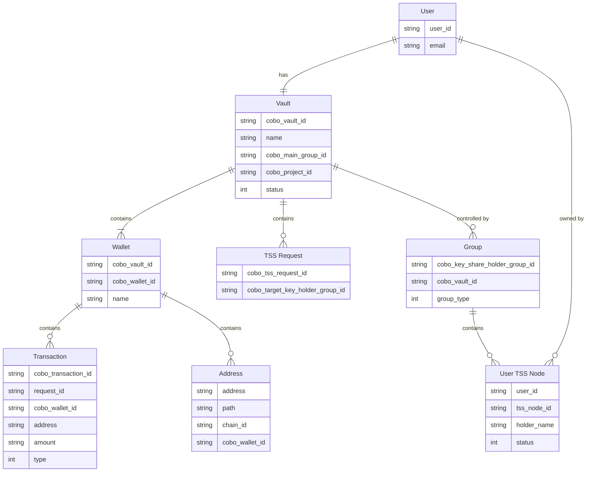

```mermaid
erDiagram
    user[User] {
        string user_id
        string email
    }
    vault[Vault] {
        string cobo_vault_id
        string name
        string cobo_main_group_id
        string cobo_project_id
        int status
    }
    group["Group"] {
        string cobo_key_share_holder_group_id
        string cobo_vault_id
        int group_type
    }
    node["User TSS Node"] {
        string user_id
        string tss_node_id
        string holder_name
        int status
    }
    wallet[Wallet] {
        string cobo_vault_id
        string cobo_wallet_id
        string name
    }
    addr[Address] {
        string address
        string path
        string chain_id
        string cobo_wallet_id
    }
    request["TSS Request"] {
        string cobo_tss_request_id
        string cobo_target_key_holder_group_id
    }
    tx[Transaction] {
        string cobo_transaction_id
        string request_id
        string cobo_wallet_id
        string address
        string amount
        int type
    }

    user ||--|| vault: has
    user||--o{ node : "owned by"
    vault ||--|{ wallet : contains
    vault ||--o{ request : "contains"
    vault ||--o{ group : "controlled by"
    wallet||--o{ tx : contains
    wallet ||--o{ addr : contains
    group ||--o{ node : contains
```
